# ESP32 电子墨水屏天气显示器

这是一个由支持WiFi的ESP32微控制器和7.5英寸电子墨水屏（E-Paper，又称E-ink）驱动的天气显示器。当前和预报的天气数据来自OpenWeatherMap API。传感器为显示器提供准确的室内温度和湿度。

  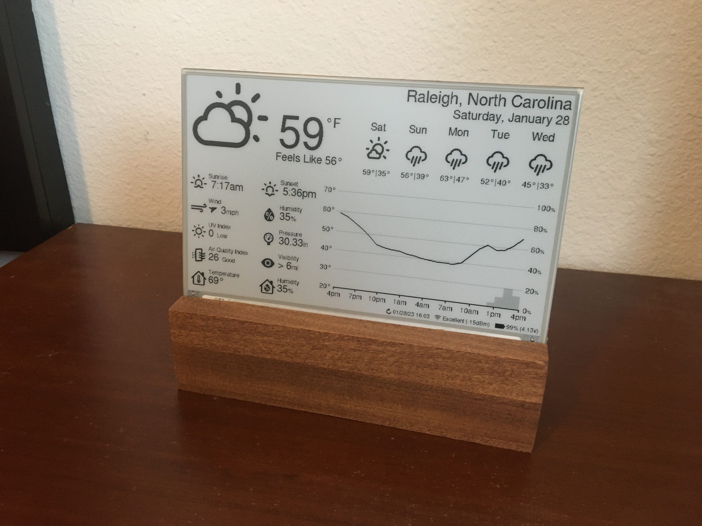
  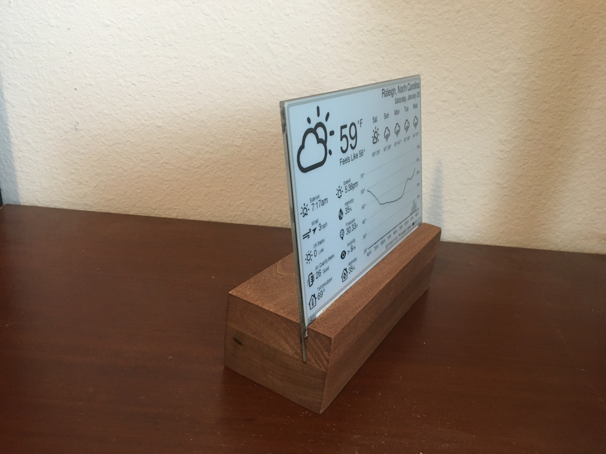
  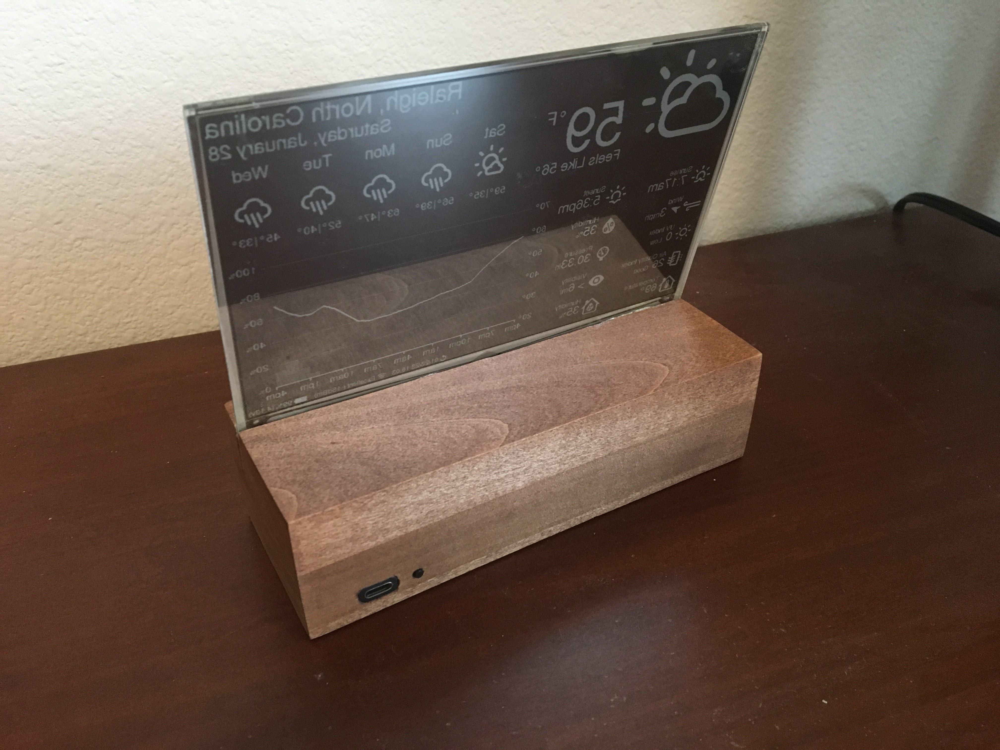
  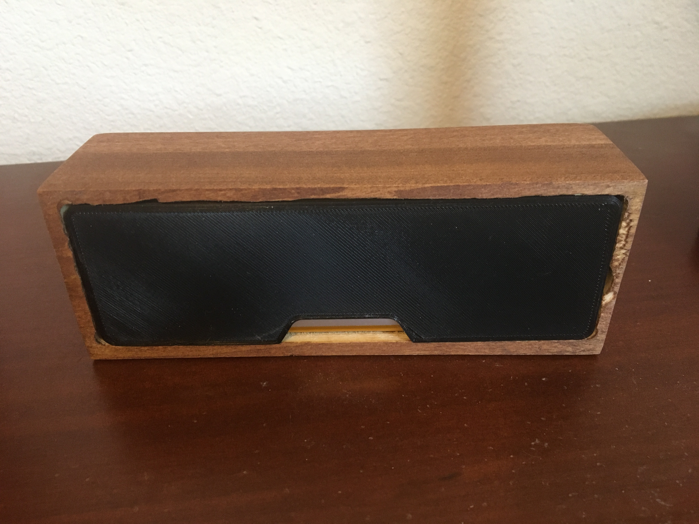
  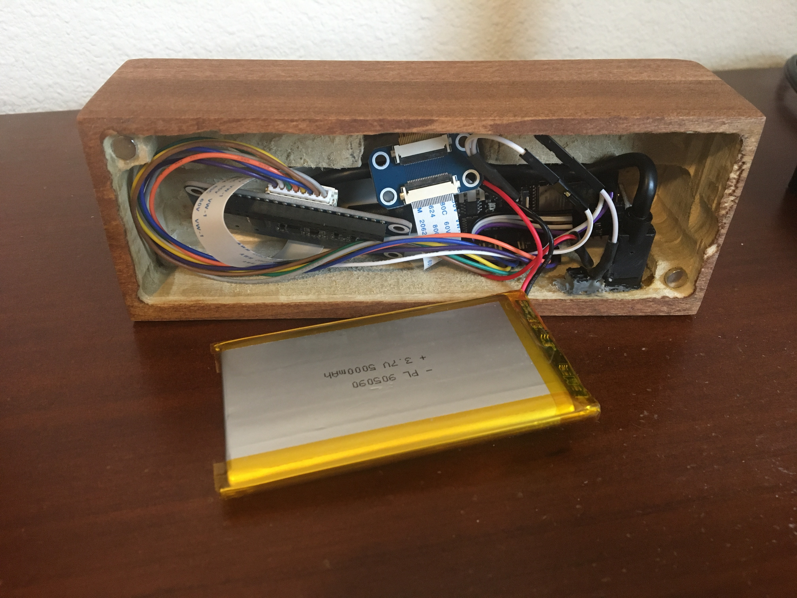

该项目在睡眠时耗电约14μA，在约15秒的唤醒期间平均耗电约83mA。显示器可以配置为按所需频率更新。当刷新间隔设置为30分钟时，设备在单个5000mAh电池上可以运行超过6个月。该项目显示准确的电池寿命百分比，并可以通过连接到墙壁适配器或计算机的USB-C电缆充电。

配置选项涵盖了从位置、时间/日期格式、单位和语言到空气质量指数刻度和小时 outlook 图表边界的所有内容。

小时 outlook 图表（右下角）显示一条表示温度的线条和表示降水概率（或可选的降水量）的阴影条。

以下是使用各种配置选项的两个示例：

  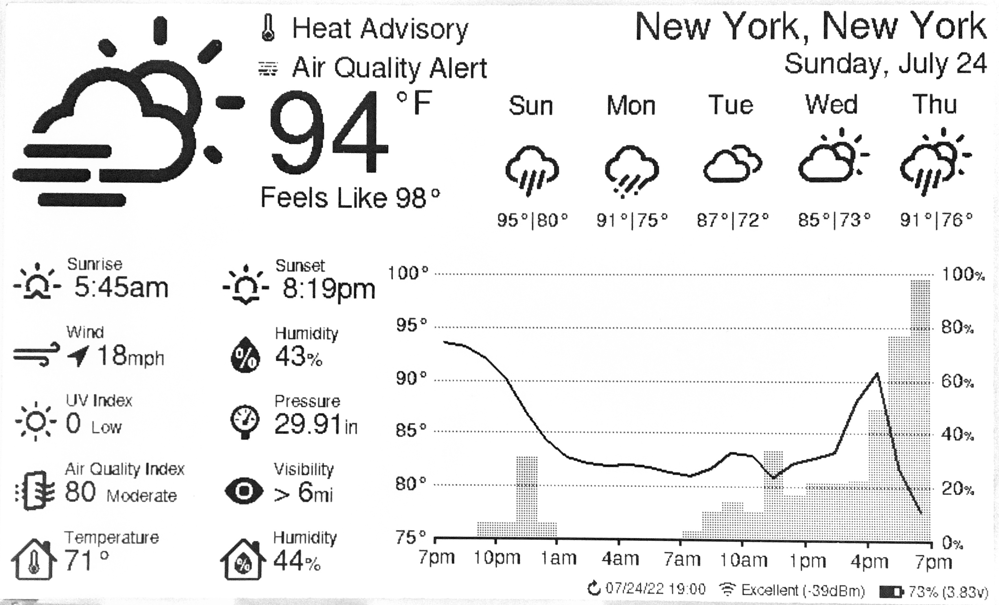
  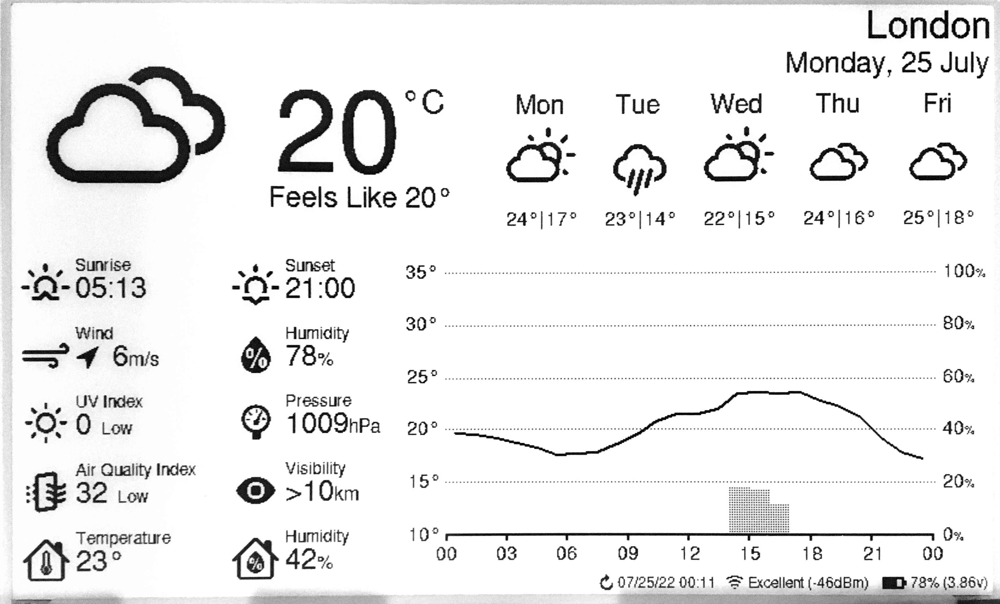

## 目录

-   [设置指南](#设置指南)
    -   [硬件](#硬件)
    -   [接线](#接线)
    -   [配置、编译和上传](#配置编译和上传)
    -   [OpenWeatherMap API密钥](#openweathermap-api密钥)
-   [错误信息和故障排除](#错误信息和故障排除)
    -   [低电量](#低电量)
    -   [WiFi连接](#wifi连接)
    -   [API错误](#api错误)
    -   [时间服务器错误](#时间服务器错误)
-   [许可](#许可)

## 设置指南

### 硬件

7.5英寸（800×480）电子墨水屏显示器

- 电子墨水屏的优势
  - 超低功耗 - 电子墨水屏（又称E-Ink）显示器非常适合不需要频繁刷新显示的低功耗应用。电子墨水屏只在刷新显示时耗电，没有背光。即使断电，图像也会保留在屏幕上。

- 电子墨水屏的局限性：
  - 颜色 - 电子墨水屏传统上仅限于黑白两色，但近年来出现了三色电子墨水屏。

  - 刷新时间和残影 - 如果刷新过快，电子墨水屏极易出现残影效应。为了避免这种情况，电子墨水屏通常需要几秒钟来刷新（本项目使用的单元为4秒），并且会在黑白之间交替几次，这可能会分散注意力。

- 面板支持：

  Waveshare和Good Display生产等效的面板。任一版本都可以工作。

  | 面板                                   | 分辨率 | 颜色          | 备注                                                                                                                 |
  |-----------------------------------------|------------|-----------------|-----------------------------------------------------------------------------------------------------------------------|
  | Waveshare 7.5英寸电子墨水屏 (v2)            | 800x480px  | 黑/白     | 在此购买 [here](https://www.waveshare.com/product/7.5inch-e-paper.htm)。 (推荐)                                |
  | Good Display 7.5英寸电子墨水屏 (GDEY075T7)  | 800x480px  | 黑/白     | 在此购买 [here](https://www.aliexpress.com/item/3256802683908868.html)。 (推荐)                                |
  | Waveshare 7.5英寸电子墨水屏 (B)             | 800x480px  | 红/黑/白 | 在此购买 [here](https://www.waveshare.com/product/7.5inch-e-paper-b.htm)。                                            |
  | Good Display 7.5英寸电子墨水屏 (GDEY075Z08) | 800x480px  | 红/黑/白 | 在此购买 [here](https://www.aliexpress.com/item/3256803540460035.html)。                                              |
  | Waveshare 7.3英寸ACeP电子墨水屏 (F)        | 800x480px  | 7色         | 在此购买 [here](https://www.waveshare.com/product/displays/e-paper/epaper-1/7.3inch-e-paper-f.htm)。                  |
  | Good Display 7.3英寸电子墨水屏 (GDEY073D46) | 800x480px  | 7色         | 在此购买 [here](https://www.aliexpress.com/item/3256805485098421.html)。                                              |
  | Waveshare 7.5英寸电子墨水屏 (v1)            | 640x384px  | 黑/白     | 支持有限。部分信息未显示，参见 [image](showcase/demo-waveshare75-version1.jpg)。                 |
  | Good Display 7.5英寸电子墨水屏 (GDEW075T8)  | 640x384px  | 黑/白     | 支持有限。部分信息未显示，参见 [image](showcase/demo-waveshare75-version1.jpg)。                 |

  该软件对强调色的支持有限。具有额外颜色的电子墨水屏面板往往有更长的刷新时间，这将减少电池寿命。

DESPI-C02 适配器板

- 没有电平转换器，与Waveshare HAT相比，更适合与3.3V处理器一起用于低功耗应用。

- 不推荐使用Waveshare HAT（rev 2.2/2.3）。它们与此项目的兼容性未经过定期测试。

- https://www.e-paper-display.com/products_detail/productId=403.html
  
- https://www.aliexpress.us/item/3256804446769469.html

FireBeetle 2 ESP32-E 微控制器

- 为什么选择ESP32？

  - 板载WiFi。

  - 520kB RAM和4MB FLASH，足以存储大量图标和字体。

  - 低功耗。

  - 体积小，有许多小型开发板可供选择。

- 为什么选择FireBeetle 2 ESP32-E

  - Drobot的FireBeetle ESP32型号针对低功耗进行了优化 (<https://diyi0t.com/reduce-the-esp32-power-consumption/>)。Drobot的FireBeetle 2 ESP32-E变体提供USB-C，但带有Micro-USB的旧版本也可以正常工作。

  - Firebeetle ESP32型号包括用于3.7v锂离子(LiPo)电池的板载充电电路。

  - FireBeetle ESP32型号包括用于监控连接到其JST-PH2.0连接器的电池电压的板载电路。

- <https://www.dfrobot.com/product-2195.html>

BME280 - 压力、温度和湿度传感器

- 提供准确的室内温度和湿度。

- 比DHT22快得多，DHT22在读取温度和湿度样本前需要等待2秒。

带2针JST连接器的3.7V锂电池

- 尺寸由您决定。我使用了一个5000mAh的电池，这样设备可以单次充电运行超过6个月。

- 当电池插入ESP32的JST连接器时，可以通过USB-C连接器将FireBeetle ESP32插入墙壁来充电。

  > **警告**
  > JST-PH2.0连接器的极性未标准化！您可能需要交换连接器中的电线顺序。

支架/框架
- 您会希望有一个好的方式来展示您的项目。以下是一些流行的选择。
- DIY木制
  - 我通过从底部挖空一块木头制作了一个小支架。在背面，我使用了一根短的USB延长线，这样我就可以在不需从支架上取下组件的情况下为电池充电。我还连接了一个小复位按钮来手动刷新显示。此外，我3D打印了一个底部盖子，用磁铁固定。电子墨水屏很薄，所以我用了一块薄薄的亚克力板来支撑它。
  - 测量数据：
    - 深度 = 63mm  
      高度 = 49mm  
      宽度 = 170.2mm (= 屏幕宽度)  
      屏幕角度 = 80度  
      屏幕距离前面15mm
- 3D可打印
  - 以下是社区设计列表。
  
    | 贡献者                                                          | 链接                                                                                                     |
    |----------------------------------------------------------------------|----------------------------------------------------------------------------------------------------------|
    | [Kingfisher](https://www.printables.com/@Kingfisher_32821)           | [Printables](https://www.printables.com/model/1139047-weather-station-e-ink-frame)                       |
    | [Francois Allard](https://www.printables.com/@FrAllard_1585397)      | [Printables](https://www.printables.com/model/791477-weather-station-using-a-esp32)                      |
    | [3D Nate](https://www.printables.com/@3DNate_451157)                 | [Printables](https://www.printables.com/model/661183-e-ink-weather-station-frame)                        |
    | [Sven F.](https://github.com/Spanholz)                               | [Printables](https://www.printables.com/model/657756-case-for-esp32-weather-station)                     |
    | [Layers Studio](https://www.printables.com/@LayersStudio)            | [Printables](https://www.printables.com/model/655768-esp32-e-paper-weather-display-stand)                |
    | [PJ Veltri](https://www.printables.com/@PJVeltri_1590999)            | [Printables](https://www.printables.com/model/692944-base-and-display-holder-for-esp-32-e-paper-weather) |
    | [TheMeanCanEHdian](https://www.printables.com/@TheMeanCanEH_1207348) | [Printables](https://www.printables.com/model/841458-weather-display-enclosure)                          |
    | [MPHarms](https://www.thingiverse.com/mpharms/designs)               | [Thingiverse](https://www.thingiverse.com/thing:6666148)                                                 |
    | [Plaste-Metz](https://www.printables.com/@PlasteMetz_576567)         | [Printables](https://www.printables.com/model/1160924-weather-station-case)                              |

  - 如果您想分享自己的3D可打印设计，非常欢迎和鼓励您的贡献！
- 相框

### 接线

引脚连接在[config.cpp](platformio/src/config.cpp)中定义。

如果您使用的是FireBeetle 2 ESP32-E，可以使用我使用的连接方式，或者按您喜欢的方式更改。

我包含了2个接线图。一个是Waveshare HAT rev2.2的，另一个是推荐的DESPI-C02的。

注意：Waveshare现在发货的是他们的电子墨水屏HAT的2.3版（不再是2.2版）。2.3版有一个额外的`PWR`引脚（未在下面的接线图中显示）；将此引脚连接到3.3V。

重要：Waveshare电子墨水屏驱动HAT有两个物理开关，必须正确设置才能使显示器工作。

- 显示配置：将开关设置到B位置。

- 接口配置：将开关设置到0位置。

重要：DESPI-C02适配器有一个物理开关，必须正确设置才能使显示器工作。

- RESE：将开关设置到0.47位置。

切断低功耗焊盘以获得更长的电池寿命。

- 来自 <https://wiki.dfrobot.com/FireBeetle_Board_ESP32_E_SKU_DFR0654>

  > 低功耗焊盘：此焊盘专为低功耗而设计。默认情况下它是连接的。您可以使用刀子切断中间的细线来断开它。断开后，静态功耗可以减少500 μA。通过程序控制主控制器进入睡眠模式后，功耗可以降低到13 μA。注意：当焊盘断开时，您只能通过USB电源驱动RGB LED灯。

  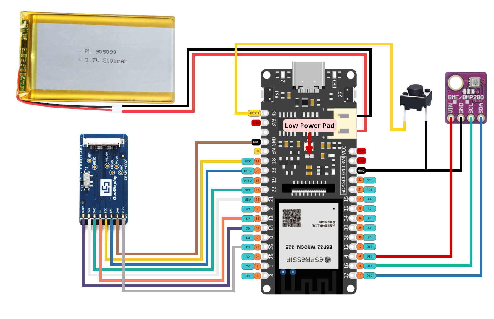
  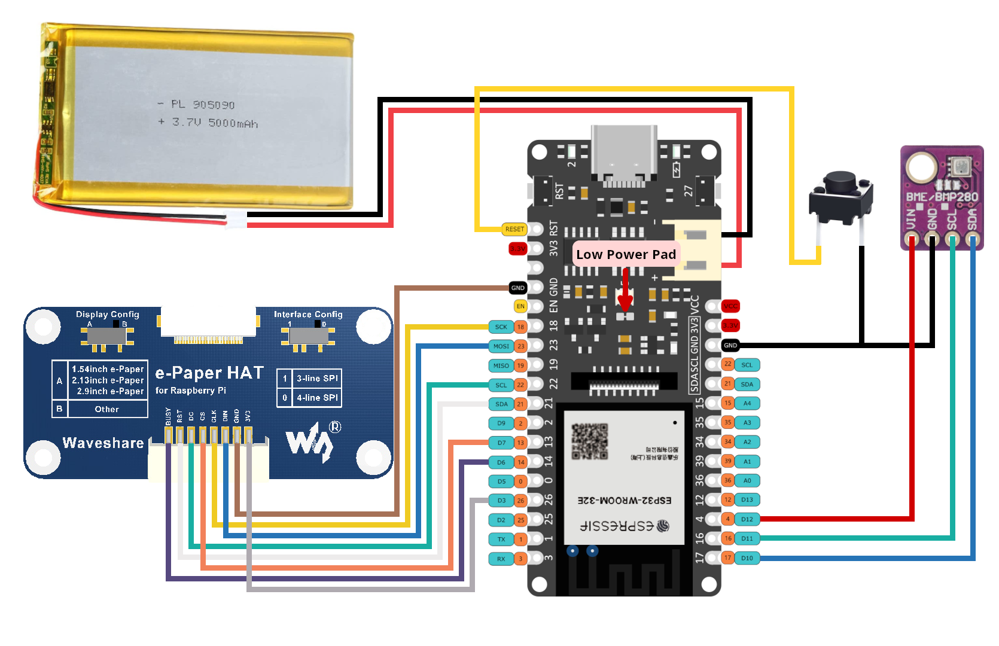
  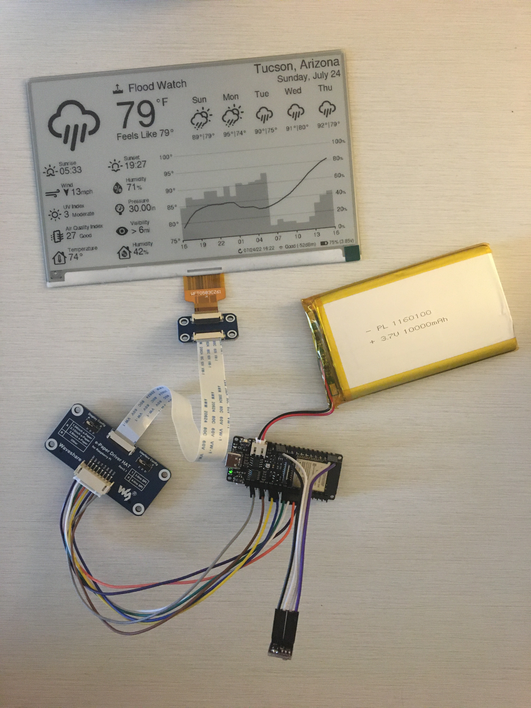

### 配置、编译和上传

VSCode的PlatformIO用于管理依赖项、代码编译和上传到ESP32。

1. 克隆此仓库或下载并解压.zip文件。

2. 安装VSCode。

3. 按照这些说明为VSCode安装PlatformIO扩展：<https://platformio.org/install/ide?install=vscode>

4. 在VSCode中打开项目。

   a. 文件 > 打开文件夹...

   b. 导航到此项目并选择名为"platformio"的文件夹。

5. 配置选项。

   - 大多数配置选项位于[config.cpp](platformio/src/config.cpp)中，少数在[config.h](platformio/include/config.h)中。区域/语言选项也可以在include/locales/locale_*.inc中找到。

   - 在config.cpp中需要配置的重要设置：

     - WiFi凭据（ssid，password）。

     - Open Weather Map API密钥（免费，有关获取API密钥的重要说明见下一节）。

     - 纬度和经度。

     - 时间和日期格式。

     - 睡眠持续时间。

     - 电子墨水屏（SPI）、BME280（I2C）和电池电压（ADC）的引脚连接。

   - 在config.h中需要配置的重要设置：

     - 单位（公制或英制）。

   - 注释详细解释了每个选项。

6. 构建和上传代码。

   a. 通过USB将ESP32连接到您的计算机。

   b. 点击VSCode窗口底部的上传箭头。（如果将鼠标悬停在上面，应该显示"PlatformIO: Upload"。）

      - PlatformIO将自动下载所需的第三方库，编译并上传代码。:)

      - 只有安装了PlatformIO扩展才能看到这个。

      - 如果使用FireBeetle 2 ESP32-E并收到错误`Wrong boot mode detected (0x13)! The chip needs to be in download mode.`，请断开板子的电源，将GPIO0（[标记为0/D5](https://wiki.dfrobot.com/FireBeetle_Board_ESP32_E_SKU_DFR0654#target_5)）连接到GND，然后重新上电以将板子置于下载模式。

      - 如果在上传过程中遇到其他错误，您可能需要安装驱动程序以允许您向ESP32上传代码。
### OpenWeatherMap API密钥

在此注册获取API密钥；它是免费的。<https://openweathermap.org/api>

此项目将调用2个不同的API（"One Call"和"Air Pollution"）。

- One Call API 3.0仅包含在"One Call by Call"订阅中。这个独立的订阅每天免费包含1000次调用，并允许您只为对此产品进行的API调用数量付费。

以下是订阅并避免任何信用卡收费的方法：
   - 前往 <https://home.openweathermap.org/subscriptions/billing_info/onecall_30/base?key=base&service=onecall_30>
   - 按照说明完成订阅。
   - 前往 <https://home.openweathermap.org/subscriptions> 并将"每天调用次数（不超过）"设置为1000。这确保您永远不会超出免费调用次数。

## 错误信息和故障排除

### 低电量
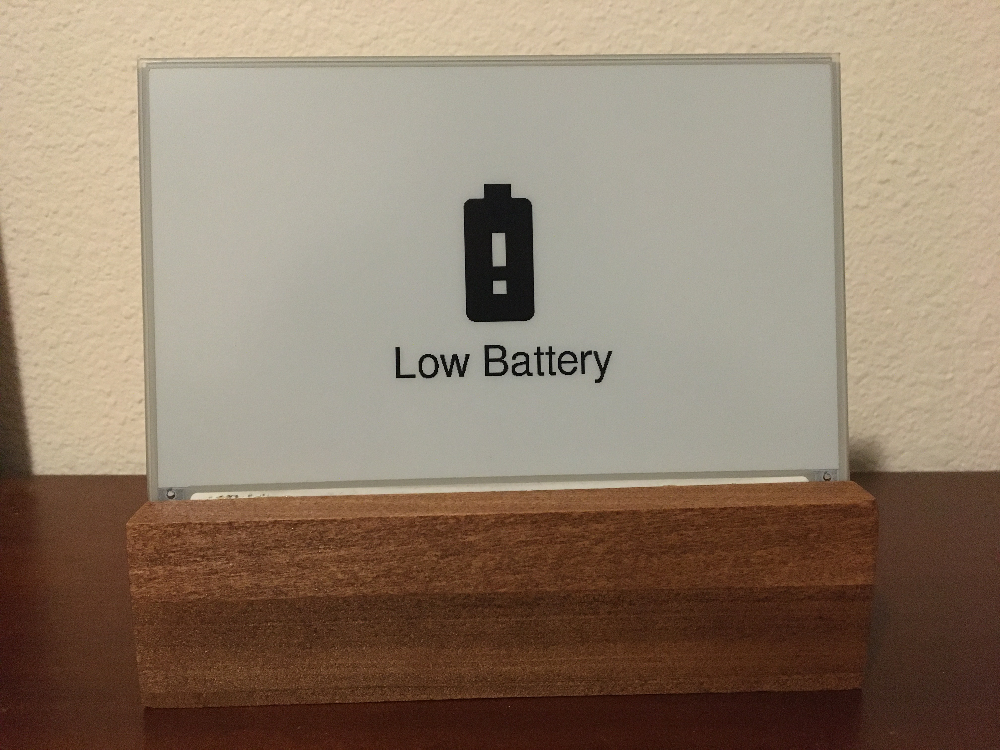
当电池电压降至LOW_BATTERY_VOLTAGE以下时（默认=3.20v），此错误屏幕会出现。显示器将不会再次刷新，直到检测到电池电压高于LOW_BATTERY_VOLTAGE。当电池电压在LOW_BATTERY_VOLTAGE和VERY_LOW_BATTERY_VOLTAGE之间时（默认=3.10v），esp32将在LOW_BATTERY_SLEEP_INTERVAL期间（默认=30分钟）深度睡眠，然后再次检查电池电压。如果电池电压在LOW_BATTERY_SLEEP_INTERVAL和CRIT_LOW_BATTERY_VOLTAGE之间（默认=3.00v），则显示器将在VERY_LOW_BATTERY_SLEEP_INTERVAL期间（默认=120分钟）深度睡眠。如果电池电压低于CRIT_LOW_BATTERY_VOLTAGE，则esp32将进入休眠模式，需要手动按下复位（RST）按钮才能开始再次更新。

 

### WiFi连接
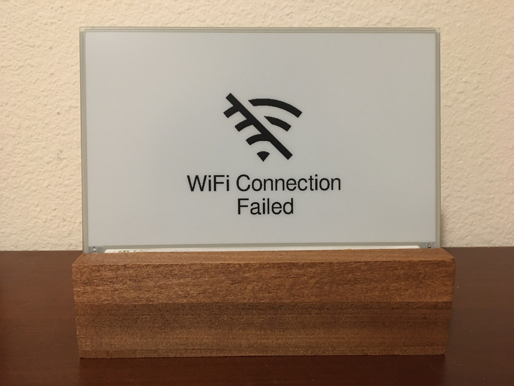
当ESP32无法连接到WiFi时，此错误屏幕会出现。如果消息显示"WiFi Connection Failed"，这可能表示密码不正确。如果消息显示"SSID Not Available"，这可能表示您拼错了SSID或esp32超出了接入点的范围。esp32将每隔SLEEP_DURATION（默认=30分钟）重试一次。

 

### API错误
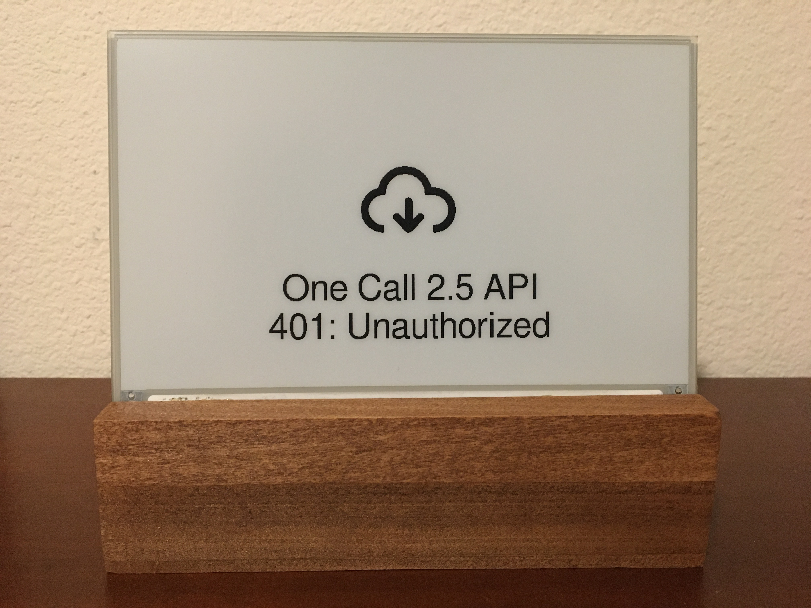
当向OpenWeatherMap发出API请求时发生错误（客户端或服务器）时，此错误屏幕会出现。第二行将给出错误代码和描述短语。正数错误代码对应HTTP响应状态代码，而错误代码<= 0表示客户端（esp32）错误。esp32将每隔SLEEP_DURATION（默认=30分钟）重试一次。
  
在左侧显示的示例中，"401: Unauthorized"可能是API密钥不正确的结果，或者您在没有适当账户设置的情况下尝试使用One Call v3 API。

 

### 时间服务器错误
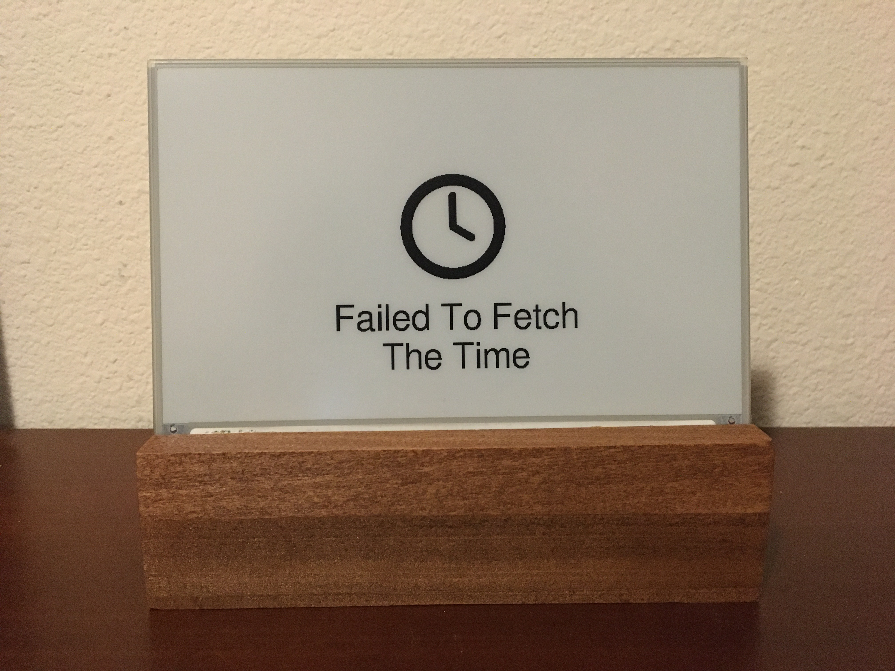
当esp32无法从NTP_SERVER_1/NTP_SERVER_2获取时间时，此错误屏幕会出现。此错误有时会在上传到esp32后立即发生；在这种情况下，只需按下复位按钮或等待SLEEP_DURATION（默认=30分钟），esp32将自动重试。如果错误持续存在，请尝试选择更近/更低延迟的时间服务器或增加NTP_TIMEOUT。

 

## 许可

esp32-weather-epd基于[GNU通用公共许可证v3.0](LICENSE)授权，工具、字体和图标的许可证如下：

| 名称 | 许可证 | 描述 |
|---------------------------------------------------------------------------------------------------------------|---------------------------------------------------------------------------------------|------------------------------------------------------------------------------------|
| [Adafruit-GFX-Library: fontconvert](https://github.com/adafruit/Adafruit-GFX-Library/tree/master/fontconvert) | [BSD许可证](fonts/fontconvert/license.txt) | 用于预处理字体以与Adafruit_GFX Arduino库一起使用的CLI工具。 |
| [pollutant-concentration-to-aqi](https://github.com/lmarzen/pollutant-concentration-to-aqi) | [GNU宽通用公共许可证v2.1](platformio/lib/pollutant-concentration-to-aqi/LICENSE) | 将污染物浓度转换为空气质量指数(AQI)的C库。 |
| [GNU FreeFont](https://www.gnu.org/software/freefont/) | [GNU通用公共许可证v3.0](https://www.gnu.org/software/freefont/license.html) | 字体系列 |
| [Lato](https://fonts.google.com/specimen/Lato) | [SIL OFL v1.1](http://scripts.sil.org/OFL) | 字体系列 |
| [Montserrat](https://fonts.google.com/specimen/Montserrat) | [SIL OFL v1.1](http://scripts.sil.org/OFL) | 字体系列 |
| [Open Sans](https://fonts.google.com/specimen/Open+Sans) | [SIL OFL v1.1](http://scripts.sil.org/OFL) | 字体系列 |
| [Poppins](https://fonts.google.com/specimen/Poppins) | [SIL OFL v1.1](http://scripts.sil.org/OFL) | 字体系列 |
| [Quicksand](https://fonts.google.com/specimen/Quicksand) | [SIL OFL v1.1](http://scripts.sil.org/OFL) | 字体系列 |
| [Raleway](https://fonts.google.com/specimen/Raleway) | [SIL OFL v1.1](http://scripts.sil.org/OFL) | 字体系列 |
| [Roboto](https://fonts.google.com/specimen/Roboto) | [Apache许可证v2.0](https://www.apache.org/licenses/LICENSE-2.0) | 字体系列 |
| [Roboto Mono](https://fonts.google.com/specimen/Roboto+Mono) | [Apache许可证v2.0](https://www.apache.org/licenses/LICENSE-2.0) | 字体系列 |
| [Roboto Slab](https://fonts.google.com/specimen/Roboto+Slab) | [Apache许可证v2.0](https://www.apache.org/licenses/LICENSE-2.0) | 字体系列 |
| [Ubuntu字体](https://design.ubuntu.com/font) | [Ubuntu字体许可证v1.0](https://ubuntu.com/legal/font-licence) | 字体系列 |
| [天气主题图标](https://github.com/erikflowers/weather-icons) | [SIL OFL v1.1](http://scripts.sil.org/OFL) | (wi-**.svg) Lukas Bischoff/Erik Flowers的天气图标系列。 |
| [Google图标](https://fonts.google.com/icons) | [Apache许可证v2.0](https://www.apache.org/licenses/LICENSE-2.0) | (battery**.svg, visibility_icon.svg) 来自Google图标的电池和能见度图标。 |
| [生物危害符号](https://svgsilh.com/image/37775.html) | [CC0 v1.0](https://en.wikipedia.org/wiki/Public_domain) | (biological_hazard_symbol.svg) 生物危害图标。 |
| [房屋图标](https://seekicon.com/free-icon/house_16) | [MIT许可证](http://opensource.org/licenses/mit-license.html) | (house.svg) 房屋图标。 |
| [室内温度/湿度图标](icons/svg) | [SIL OFL v1.1](http://scripts.sil.org/OFL) | (house_**.svg) 室内温度/湿度图标。 |
| [电离辐射符号](https://svgsilh.com/image/309911.html) | [CC0 v1.0](https://creativecommons.org/publicdomain/zero/1.0/) | (ionizing_radiation_symbol.svg) 电离辐射图标。 |
| [Phosphor图标](https://github.com/phosphor-icons/homepage) | [MIT许可证](http://opensource.org/licenses/mit-license.html) | (wifi**.svg, warning_icon.svg, error_icon.svg) 来自Phosphor图标的WiFi、警告和错误图标。 |
| [风向图标](https://www.onlinewebfonts.com/icon/251550) | [CC BY v3.0](http://creativecommons.org/licenses/by/3.0) | (meteorological_wind_direction_**deg.svg) 来自Online Web Fonts的气象风向图标。 |